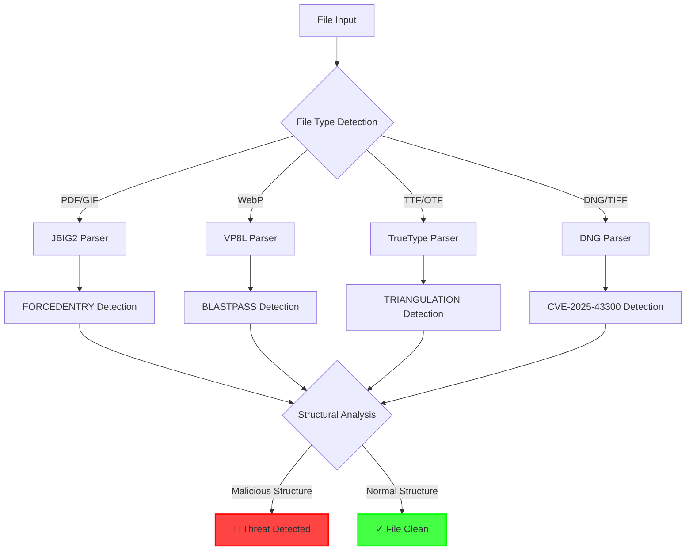
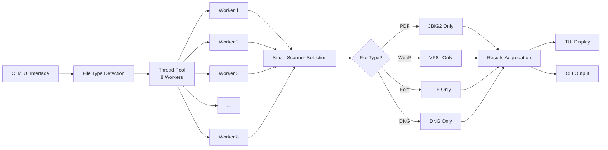
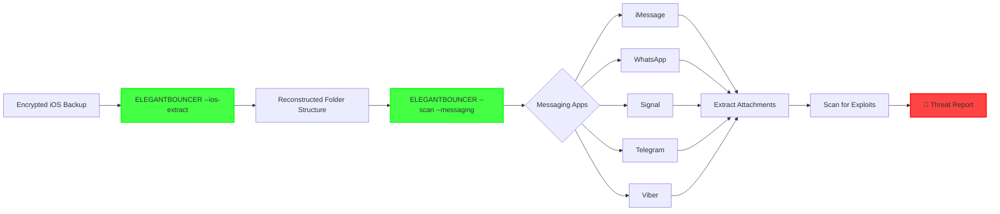

ELEGANTBOUNCER: When You Can't Get the Samples but Still Need to Catch the Threat | Matt Suiche             

[←Home](/) [Blog](/posts) [About](/about) [Press](/press) [Media](/media)

# ELEGANTBOUNCER: When You Can't Get the Samples but Still Need to Catch the Threat

Aug 24, 2025 · 1909 words · 9 minute read

## The Genesis: When Signatures Aren’t Enough [🔗](#the-genesis-when-signatures-arent-enough)

In the world of mobile security research, there’s a recurring frustration that keeps many of us up at night: the most sophisticated exploits - the ones that really matter - are rarely shared. When [Citizen Lab](https://citizenlab.ca) and [Google TAG](https://blog.google/threat-analysis-group/) discover NSO Group’s latest 0-click exploits targeting journalists and activists, we get brilliant technical writeups, CVE numbers, and patches. What we don’t get? The actual samples.

This isn’t a criticism - there are excellent reasons for limiting access to weaponized exploits. But it creates a fundamental problem: **How do you protect against threats you’ve never seen?**

Traditional detection approaches like YARA rules, IOC matching, and signature-based systems fall apart when:

*   You don’t have the actual malicious samples to create signatures from
*   The attackers use polymorphic techniques that change file hashes
*   The exploit leverages legitimate file format features in unexpected ways
*   You need to detect future variants of the same technique

This is where [**ELEGANTBOUNCER**](https://github.com/msuiche/elegant-bouncer) was born - not from having access to elite exploit collections, but from the opposite: having to detect threats based solely on technical descriptions, vulnerability reports, and proof-of-concept recreations.

## The Philosophy: Structure Over Signatures [🔗](#the-philosophy-structure-over-signatures)

ELEGANTBOUNCER takes a fundamentally different approach to threat detection. Instead of looking for specific byte patterns or known-bad indicators, it analyzes the **structural properties** of files that make exploits possible.



Consider **FORCEDENTRY** (CVE-2021-30860) - NSO’s JBIG2 PDF exploit. Traditional detection would look for specific PDF hash values or byte sequences from known samples. ELEGANTBOUNCER instead asks: _“Does this PDF contain a JBIG2 stream with an arithmetic decoder configuration that enables the integer overflow?"_

This structural approach means we can detect:

*   The original FORCEDENTRY samples (which we’ve never seen)
*   Modified variants with different payloads
*   Future exploits using the same vulnerability
*   Even proof-of-concept files created by researchers

## The Exploits We Hunt [🔗](#the-exploits-we-hunt)

### FORCEDENTRY: The PDF That Shouldn’t Parse [🔗](#forcedentry-the-pdf-that-shouldnt-parse)

When Apple patched CVE-2021-30860 in September 2021, they revealed it was actively exploited to deliver NSO Group’s Pegasus spyware. The vulnerability lived in how iOS processed JBIG2-compressed images within PDFs. I detailed my research approach in [“Researching FORCEDENTRY: Detecting the Exploit With No Samples”](/posts/researching-forcedentry-detecting-the-exploit-with-no-samples/), where I showed how to build detection without having access to the actual exploit.

ELEGANTBOUNCER detects this by analyzing the JBIG2 symbol dictionary structure:

```rust
// From src/jbig2.rs - Detecting the impossible
if input_symbols_count == 0 && (ex_syms > 0 && ex_syms < 4) {
    return Ok(ScanResultStatus::StatusMalicious);
}
```

No signatures needed - just mathematical impossibilities that indicate exploitation.

### BLASTPASS: When WebP Compression Goes Wrong [🔗](#blastpass-when-webp-compression-goes-wrong)

The BLASTPASS exploit chain (CVE-2023-4863) weaponized a heap buffer overflow in WebP’s Huffman table construction. Again, we had technical details but no samples. My two-part analysis ([“Part 1: Detecting the exploit inside a WebP file”](/posts/researching-blastpass-detecting-the-exploit-inside-a-webp-file-part-1/) and [“Part 2: Analysing the Apple & Google WebP POC file”](/posts/researching-blastpass-analysing-the-apple-google-webp-poc-file-part-2/)) demonstrated how to reverse-engineer the vulnerability from patches alone.

Our detection examines the VP8L prefix code structure:

```rust
// Detecting malformed Huffman tables that trigger overflow
let total_size = table_sizes.iter().sum::<usize>();
if total_size > 2954 {  // FIXED_TABLE_SIZE + MAX_TABLE_SIZE
    return Ok(ScanResultStatus::StatusMalicious);
}
```

### TRIANGULATION: The Font That Executes Code [🔗](#triangulation-the-font-that-executes-code)

Operation Triangulation used CVE-2023-41990, exploiting undocumented TrueType instructions. This is where structural detection shines - we’re looking for bytecode that shouldn’t exist. My research in [“Detecting CVE-2023-41990 with single byte signatures”](/posts/researching-triangulation-detecting-cve-2023-41990-with-single-byte-signatures/) showed how even sophisticated font exploits can be caught with minimal signatures.

```rust
// Detecting undocumented ADJUST instructions
match opcode {
    0x8F | 0x90 => {  // Undocumented instructions used by TRIANGULATION
        return Ok(ScanResultStatus::StatusMalicious);
    }
    // ... normal instruction handling
}
```

### CVE-2025-43300: The Latest Addition [🔗](#cve-2025-43300-the-latest-addition)

Just this week, Apple acknowledged that CVE-2025-43300 was exploited in the wild. It’s a DNG processing vulnerability where metadata lies about image structure. You can read more about this latest discovery in my [“CVE-2025-43300: Critical Vulnerability Found in Apple’s DNG Image Processing”](/posts/cve-2025-43300-critical-vulnerability-found-in-apples-dng-image-processing/) post.

```rust
// When metadata says 2 components but data has 1
if samples_per_pixel == 2 && sof3_components == 1 {
    return Ok(ScanResultStatus::StatusMalicious);
}
```

## The Architecture: Fast, Parallel, and Visual [🔗](#the-architecture-fast-parallel-and-visual)

ELEGANTBOUNCER isn’t just about detection algorithms - it’s about making those algorithms practical for real-world use:



### Performance Optimizations [🔗](#performance-optimizations)

Early versions scanned every file with every detector - painfully slow. Now we:

*   **Smart Detection**: Only run relevant scanners based on file type
*   **Parallel Processing**: Up to 8 concurrent scans using Rayon
*   **Early Termination**: Stop scanning once a threat is found
*   **Efficient Parsing**: Minimal memory allocation, streaming where possible

### The Terminal UI Experience [🔗](#the-terminal-ui-experience)

For batch scanning, ELEGANTBOUNCER provides a real-time TUI showing all parallel scanning threads:


The interface shows:

*   All 8 worker threads and their current files
*   Real-time progress across the scan
*   Immediate threat notifications
*   Final summary with infected file list

## Real-World Application: iOS Backup Forensics [🔗](#real-world-application-ios-backup-forensics)

One of ELEGANTBOUNCER’s most powerful features is its ability to scan iOS backup dumps for threats hidden in messaging app attachments. The tool now includes integrated iOS backup reconstruction functionality, eliminating the need for external scripts. This messaging app scanning capability was initially implemented by [@hkashfi](https://x.com/hkashfi), whose contribution made iOS backup forensics analysis possible.

### The iOS Backup Challenge [🔗](#the-ios-backup-challenge)

iOS backups aren’t human-readable by default - files are stored with SHA256 hashes as names, making manual analysis nearly impossible. ELEGANTBOUNCER now includes a built-in `--ios-extract` feature that:

1.  Extracts the actual file paths from the backup’s `Manifest.db`
2.  Rebuilds the original folder structure
3.  Makes the backup analyzable by security tools

This reconstruction functionality, originally inspired by [@hkashfi](https://x.com/hkashfi)’s ios-backup-reconstruct.py script, is now fully integrated in Rust for better performance and seamless workflow.

### Scanning Messaging Apps for 0-Click Exploits [🔗](#scanning-messaging-apps-for-0-click-exploits)

ELEGANTBOUNCER can automatically scan multiple messaging platforms within iOS backups:

```rust
// From src/messaging.rs - Automatic threat detection across platforms
pub fn scan_messaging_apps(path: &Path) -> Vec<MessagingResult> {
    // Automatically detects and scans:
    // - iMessage (sms.db)
    // - WhatsApp (ChatStorage.sqlite) 
    // - Signal (encrypted, but scans attachments)
    // - Telegram (cache directories)
    // - Viber (Viber.sqlite)
}
```

The scanner intelligently:

*   **Parses SQLite databases** to locate attachment paths
*   **Reconstructs file locations** from relative paths
*   **Scans all media files** for FORCEDENTRY, BLASTPASS, TRIANGULATION, and CVE-2025-43300
*   **Extracts embedded objects** from PDFs for deep inspection

### Real Forensics Workflow [🔗](#real-forensics-workflow)



When a threat is detected, ELEGANTBOUNCER provides detailed context:

*   **Origin**: Which app and conversation contained the file
*   **Sender**: Who sent the malicious attachment (when available)
*   **Timestamp**: When the file was received
*   **Threat Type**: Which exploit was detected

This forensic capability has proven invaluable for:

*   **Incident Response**: Determining if a device was targeted
*   **Threat Intelligence**: Understanding attack patterns
*   **Legal Cases**: Providing evidence of compromise attempts
*   **Security Audits**: Checking devices of high-risk individuals

### A Real Detection Example [🔗](#a-real-detection-example)

```bash
# Step 1: Extract the iOS backup to readable structure
$ ./elegant-bouncer --ios-extract /path/to/backup --output /tmp/reconstructed
► iOS Backup Reconstruction
  Source: /path/to/backup
  Output: /tmp/reconstructed
[+] Reading Manifest.db...
[+] Found 42,847 file records to process
⠏ [00:02:31] [████████████████████████████████████████] 42847/42847 (100%)
✓ iOS backup extraction completed successfully!

# Step 2: Scan the reconstructed backup for threats
$ ./elegant-bouncer --scan --messaging /tmp/reconstructed
[+] Starting messaging app scan...
  ► Found iMessage database
  ► Found WhatsApp database
  ► Found Signal database (encrypted)
  ► Found Telegram cache directories
[+] Found 847 messaging app attachments to scan

      ✗ THREAT in WhatsApp chat 'John Doe': suspicious_document.pdf
        → FORCEDENTRY detected (JBIG2 integer overflow)
      
      ✗ THREAT in iMessage from +1-555-0123 on 2024-08-15: photo.webp
        → BLASTPASS detected (malformed Huffman table)

[!] Scan complete: 2 infected files detected out of 847 scanned
```

## The Limitations: What We Can’t Detect (Yet) [🔗](#the-limitations-what-we-cant-detect-yet)

Honesty matters in security tools. ELEGANTBOUNCER has limitations:

1.  **TRIANGULATION’s ADJUST Instruction**: We detect the presence of undocumented opcodes (0x8F, 0x90) but can’t fully emulate their behavior without Apple’s implementation details.
    
2.  **Polymorphic Variants**: While we catch structural exploitation, sufficiently creative variations might evade detection.
    
3.  **Unknown Unknowns**: We can only detect exploit techniques we understand. The next NSO 0-day using a completely novel approach would slip through.
    
4.  **False Positives**: Structural analysis can flag legitimate files with unusual but benign properties.
    

## The Call to Action: This is Just the Beginning [🔗](#the-call-to-action-this-is-just-the-beginning)

ELEGANTBOUNCER is open source for a reason. The mobile security community needs tools that:

*   Don’t depend on having exclusive access to threat samples
*   Can detect entire classes of exploits, not just specific instances
*   Evolve as new techniques emerge
*   Remain accessible to defenders worldwide

If you’ve researched mobile exploits, analyzed iOS attack chains, or reverse-engineered file format vulnerabilities, **we need your expertise**. Every new detection method makes the tool stronger.

### Contributing [🔗](#contributing)

The project needs:

*   **New Detection Methods**: Structural patterns for other iOS/Android exploits
*   **Sample Generation**: Proof-of-concept files for testing (clearly marked as such)
*   **Performance Improvements**: Making detection even faster
*   **Integration**: Embedding ELEGANTBOUNCER in security pipelines

Visit [github.com/msuiche/elegant-bouncer](https://github.com/msuiche/elegant-bouncer) to contribute.

## Looking Forward: The Future of Structural Detection [🔗](#looking-forward-the-future-of-structural-detection)

As mobile devices become increasingly locked down, attackers are forced to be more creative. The era of simple memory corruption is over; the era of logic exploitation is here. This means:

*   **More Format Confusion**: Exploits that abuse parser disagreements
*   **Spec Ambiguities**: Leveraging undefined behavior in standards
*   **Feature Abuse**: Using legitimate functionality in unexpected ways
*   **Supply Chain Attacks**: Compromising the tools that create files

ELEGANTBOUNCER’s structural approach positions it well for this future. By focusing on _how_ files deviate from expected patterns rather than _what_ specific bytes they contain, we can adapt to new techniques as they emerge.

## Conclusion: Detection Without Samples [🔗](#conclusion-detection-without-samples)

ELEGANTBOUNCER represents a philosophy shift in mobile threat detection. Born from the frustration of analyzing threats we couldn’t access, it proves that effective detection doesn’t require a vault of secret samples - it requires understanding the fundamental mechanics of exploitation.

Every time a new iOS 0-click appears in the wild, every time researchers reverse-engineer an Android exploit chain, every time a new file format confusion is discovered, ELEGANTBOUNCER grows stronger. Not through signatures or hashes, but through understanding.

The elegant part isn’t the code - it’s the realization that **we don’t need the actual exploits to catch them**. We just need to understand what makes them possible.

* * *

_Have you discovered a new mobile exploit technique? Found a detection bypass? Want to contribute? Check out [ELEGANTBOUNCER on GitHub](https://github.com/msuiche/elegant-bouncer) or reach out on [Twitter](https://twitter.com/msuiche)._

_Special thanks to the researchers at Citizen Lab, Google TAG, and the broader security community whose detailed technical writeups made this project possible. Your transparency in describing threats, even when samples can’t be shared, enables defenders worldwide._

[FORCEDENTRY](https://www.msuiche.com/tags/forcedentry) [BLASTPASS](https://www.msuiche.com/tags/blastpass) [TRIANGULATION](https://www.msuiche.com/tags/triangulation) [CVE-2021-30860](https://www.msuiche.com/tags/cve-2021-30860) [CVE-2023-4863](https://www.msuiche.com/tags/cve-2023-4863) [CVE-2025-43300](https://www.msuiche.com/tags/cve-2025-43300) [NSO](https://www.msuiche.com/tags/nso) [Pegasus](https://www.msuiche.com/tags/pegasus) [0-click](https://www.msuiche.com/tags/0-click) [Detection](https://www.msuiche.com/tags/detection)

[](https://github.com/msuiche)[](https://instagram.com/msuiche__)[](https://www.linkedin.com/in/msuiche/?originalSubdomain=us)[/>](https://twitter.com/msuiche)

© Copyright 2022 ❤️