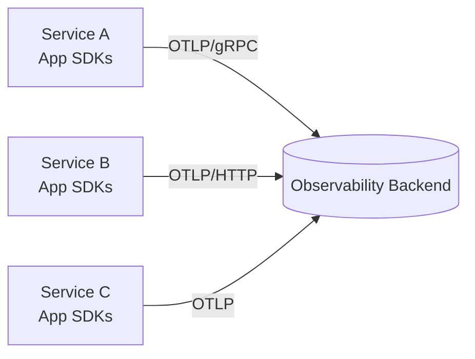
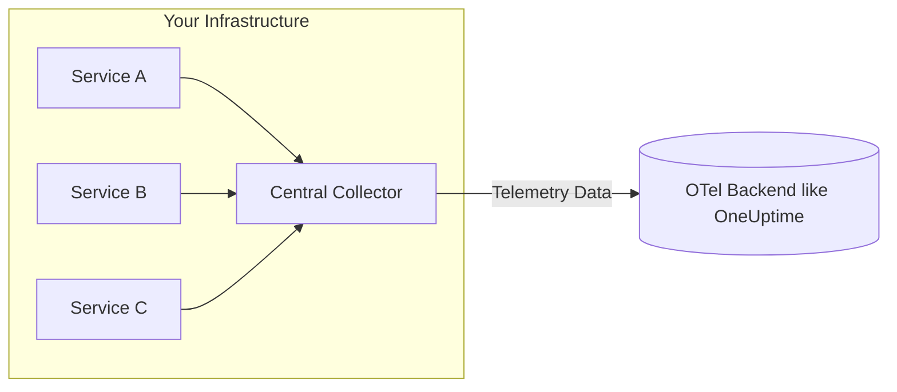

OpenTelemetry Collector: What It Is, When You Need It, and When You Don’t                                                               

[OneUptime ](/) 

Open menu

Products

[

Status Pages

Status Page helps you be more transparent with your customers and showcase reliability.


](/product/status-page)[

Monitoring

Analyse uptime and performance of all of your resources.


](/product/monitoring)[

Incident Management

Protect revenue and improve customer experiences by resolving incidents faster.


](/product/incident-management)[

On-Call and Alerts

Alert right people at the right time. Create on-call schedules and more.


](/product/on-call)[

Logs Management

Fastest log software on the planet. Ingest logs from any source and search in seconds.


](/product/logs-management)[

APM

Monitor performance of any app, any service, any stack.


](/product/apm)[

Workflows

Integrate with 5000+ different services and products without writing any code.


](/product/workflows)

[Request Demo](/enterprise/demo)

[Contact Sales](/cdn-cgi/l/email-protection#3043515c5543705f5e55454044595d551e535f5d)

[Pricing](/pricing) [Enterprise](/enterprise/overview) [Request Demo](/enterprise/demo)

More

[

Docs

Learn more about OneUptime by reading our docs.


](/docs)[

API Reference

Connect OneUptime with the rest of your software stack.


](/reference)[

Learning Resources and Blog

Learn about observability and keep yourself updated.


](/blog)[

Help & Support

Get all of your questions answered by contacting support.


](/support)[

GitHub

Check the code out, create new feature requests all on GitHub.


](https://github.com/oneuptime/oneuptime)[

Merch Store

Buy our merch and support open source development.


](https://shop.oneuptime.com)[

About Us

Learn more about why we are building OneUptime.


](/about)[

Legal Center

See our terms, privacy, GDPR, SOC documents.


](/legal)

[Sign in](/accounts) [Sign up](/accounts/register)


Close menu

[Status Page](/product/status-page) [Monitoring](/product/monitoring) [Incident Management](/product/incident-management) [On-Call and Alerts](/product/on-call) [Logs Management](/product/logs-management) [APM](/product/apm) [Workflows](/product/workflows)

[Pricing](/pricing) [Enterprise](/enterprise/overview) [Request Demo](/enterprise/demo) [Support](/support)

[Sign up](/accounts/register)

Existing customer? [Sign in](/accounts)

# OpenTelemetry Collector: What It Is, When You Need It, and When You Don’t

A practical, no-fluff guide to understanding the OpenTelemetry Collector - what it does, how it works, real architecture patterns (with and without it), and how to decide if/when you should deploy one for performance, control, security, and cost efficiency.

 [ @devneelpatel](https://github.com/devneelpatel) • Sep 18, 2025 • Reading time

[OpenTelemetry](/blog/tag/opentelemetry) [Observability](/blog/tag/observability) [Metrics](/blog/tag/metrics) [Logs](/blog/tag/logs) [Traces](/blog/tag/traces) [Collector](/blog/tag/collector) [Cost Optimization](/blog/tag/cost-optimization) [Reliability](/blog/tag/reliability) [Sampling](/blog/tag/sampling)

* * *

> Do you really need an OpenTelemetry Collector? If you're just sprinkling SDKs into a side project - maybe not. If you're running a multi-service production environment and care about cost, performance, security boundaries, or intelligent processing - yes, you almost certainly do.

This post explains _exactly_ what the OpenTelemetry Collector is, why it exists, how data flows **with** and **without** it, and the trade‑offs of each approach. You’ll leave with a decision framework, deployment patterns, and practical configuration guidance.

* * *

## Quick Definition

The **OpenTelemetry Collector** is a **vendor‑neutral, pluggable telemetry pipeline** that receives, processes, and exports telemetry signals (traces, metrics, logs, profiles, more coming) from your applications to one or more backends (one of those backends is [OneUptime](https://oneuptime.com)).

It removes vendor SDK lock‑in, centralizes telemetry policy, and gives you a programmable choke point to:

*   Clean the data (remove sensitive fields, add context)
*   Batch sends and retry automatically when exports fail
*   Sample smartly (keep errors & rare slow traces, trim noisy success traffic)
*   Smooth out differences between frameworks / SDK versions
*   Route traces, metrics, and logs to different backends
*   Act as a safety barrier between app nodes and the public internet
*   Cut cost early by dropping low‑value or redundant telemetry

* * *

## Architecture at 10,000ft

### 1\. Without a Collector (Direct Export)

Each service ships telemetry directly to your backend (e.g., OneUptime, another SaaS, or self‑hosted store):



**Pros:**

*   Simpler (fewer moving parts)
*   Lower operational overhead
*   Good for small apps / POCs

**Cons:**

*   Each service handles retries, auth, backpressure
*   Hard to change exporters later (coupling)
*   No central sampling / scrubbing / routing
*   Higher risk of SDK or network misconfig hurting reliability
*   Increased egress cost if sending duplicate data to multiple vendors

### 2\. With a Central Collector

All apps send to a centralized Collector (or a tiered set) which then exports.



**Pros:**

*   Centralized config: sampling, redaction, enrichment
*   One egress channel with batching & retry
*   Decouple app lifecycle from vendor changes
*   Multi-destination routing (e.g., traces, metrics, logs → OneUptime, logs → S3)
*   Reduce noisy telemetry before it hits priced tiers
*   Security boundary: no direct outbound to internet from app nodes

**Cons:**

*   Extra component to deploy / monitor
*   Potential chokepoint (must size + scale properly)
*   Misconfiguration can drop all telemetry

* * *

## Direct Export vs Collector: Side‑by‑Side

Dimension

Direct Export

Collector-Based

Setup Speed

Fast

Moderate

Policy Control (sampling/redaction)

Per service

Centralized

Multi-backend Routing

Manual duplication

Built-in pipelines

Cost Optimization

Hard

Easy (drop early)

Failure Isolation

Each app handles retries

Central queue + backpressure

Security (egress lockdown)

Outbound from every app

Single controlled egress

Config Drift Risk

High

Low (single source)

Vendor Migration

Painful (touch all apps)

Swap exporter centrally

Scaling Pressure

Apps bear it

Collector tier handles it

Recommended For

Small app / POC

Production / multi-service

* * *

## What the Collector Actually Does (Core Concepts)

Component

Purpose

Receivers

Ingest telemetry (OTLP, Jaeger, Prometheus, Zipkin, Syslog, etc.)

Processors

Transform / batch / sample / tail filter / memory limit

Exporters

Send to destinations (OTLP, Kafka, S3, logging, load balancers)

Extensions

Auth, health check, zpages, pprof, headers, feature add-ons

Pipelines

Declarative graphs binding receiver → processors → exporter

A minimal example pipeline (YAML):

```yaml
receivers:
  otlp:
    protocols:
      grpc:
      http:

processors:
  batch:
    send_batch_max_size: 8192
    timeout: 5s
  memory_limiter:
    limit_mib: 512
    spike_limit_mib: 128
    check_interval: 2s
  attributes/redact:
    actions:
      - key: user.email
        action: delete
  tail_sampling:
    decision_wait: 5s
    num_traces: 10000
    policies:
      - name: errors
        type: status_code
        status_code:
          status_codes: [ERROR]
      - name: latency
        type: latency
        latency:
          threshold_ms: 500

exporters:
  otlphttp_oneuptime:
    endpoint: https://oneuptime.com/otlp/v1/traces
    headers:
      x-oneuptime-token: ${ONEUPTIME_TOKEN}


service:
  pipelines:
    traces:
      receivers: [otlp]
      processors: [memory_limiter, batch, tail_sampling, attributes/redact]
      exporters: [otlphttp_oneuptime]
    metrics:
      receivers: [otlp]
      processors: [memory_limiter, batch]
      exporters: [otlphttp_oneuptime]
    logs:
      receivers: [otlp]
      processors: [memory_limiter, batch, attributes/redact]
      exporters: [otlphttp_oneuptime]
    
```

* * *

## When You Definitely Need a Collector

*   You want **tail sampling** (decide after seeing full trace) to keep 100% of errors & rare paths but downsample boring traffic.
*   You need **multi-destination routing** (e.g., traces, metrics, logs → OneUptime, logs → S3/ClickHouse, security events → SIEM).
*   You must **strip sensitive PII** before it leaves your network.
*   You need **cost governance**—drop chatty spans/metrics at the edge.
*   You want **hot-swappable vendors** without touching app code.
*   You require **network isolation** (no direct internet from app nodes).
*   You need **central retries / buffering** to survive outages gracefully.

## When You Can Probably Skip It (For Now)

*   Single service + low traffic.
*   You only emit a few key metrics and a handful of spans.
*   You are experimenting locally / learning OTel basics.
*   You have no current need for sampling, routing, or redaction.

(But design your app setup so you can add a collector later with a one-line endpoint change. Ideally an env variable change)

* * *

## Cost Optimization: Why the Collector Often Pays for Itself

Raw telemetry can explode: high-cardinality logs, trace spans for internal cron noise, verbose debug metrics. Sending everything directly → backend = surprise bill.

Collector lets you:

*   Batch aggressively → fewer network round trips
*   Drop low-value spans (health checks, cache hits)
*   Tail sample: keep 100% of errors, maybe 10% of success
*   Strip high-cardinality attributes before storage
*   Aggregate / reduce metrics before export
*   Route _only_ audit-critical logs to expensive storage; bulk to cheap object store

> Every dollar saved upstream compounds monthly. The collector is your first cost control valve.

* * *

## Observing the Observer: Collector Internal Metrics

You can (and should) scrape the collector's own metrics to watch queue length, dropped spans, export latency. See our post:

*   [How to collect internal metrics from OpenTelemetry Collector?](https://oneuptime.com/blog/post/2025-01-22-how-to-collect-opentelemetry-collector-internal-metrics/view)
*   [How to increase the size of the sending queue in OpenTelemetry Collector?](https://oneuptime.com/blog/post/2025-01-20-increase-size-of-open-telemetry-collector-queue/view)

* * *

## Related Concepts

*   [Traces vs Metrics in Software Observability](https://oneuptime.com/blog/post/2025-08-21-traces-vs-metrics-in-opentelemetry/view)
*   [Logs, Metrics & Traces: A Before and After Story.](https://oneuptime.com/blog/post/2025-08-21-logs-traces-metrics-before-and-after/view)
*   [How to reduce noise in OpenTelemetry?](https://oneuptime.com/blog/post/2025-08-25-how-to-reduce-noise-in-opentelemetry/view)

* * *

## Final Take

If observability is core to operating your system (it should be), the Collector becomes the _control plane_ for your telemetry. Start simple, add capabilities incrementally, and let it pay for itself through cost savings, flexibility, and reliability.

> Golden rule: **Emit broadly at the edge, curate aggressively in the pipeline, store intentionally in the backend.** The Collector is where that curation lives.

* * *

Need a production-grade backend for your Collector pipelines? **OneUptime** natively supports OpenTelemetry for traces, metrics, logs, and more - without vendor lock‑in.

Happy instrumenting.

Share this article

[](https://twitter.com/intent/tweet?text=%20OpenTelemetry%20Collector%3A%20What%20It%20Is%2C%20When%20You%20Need%20It%2C%20and%20When%20You%20Don%E2%80%99t&url=https%3A%2F%2Foneuptime.com%2Fblog%2Fpost%2F2025-09-18-what-is-opentelemetry-collector-and-why-use-one%2Fview "Share on X")[](https://www.linkedin.com/sharing/share-offsite/?url=https%3A%2F%2Foneuptime.com%2Fblog%2Fpost%2F2025-09-18-what-is-opentelemetry-collector-and-why-use-one%2Fview "Share on LinkedIn")[](https://news.ycombinator.com/submitlink?u=https%3A%2F%2Foneuptime.com%2Fblog%2Fpost%2F2025-09-18-what-is-opentelemetry-collector-and-why-use-one%2Fview&t=%20OpenTelemetry%20Collector%3A%20What%20It%20Is%2C%20When%20You%20Need%20It%2C%20and%20When%20You%20Don%E2%80%99t "Discuss on Hacker News")


### Neel Patel

@devneelpatel • Sep 18, 2025 •

Building reliable software at OneUptime. Follow along for more on observability & reliability.

[View GitHub](https://github.com/devneelpatel)

Our Commitment to Open Source

*   Everything we do at OneUptime is 100% open-source. You can contribute by writing a post just like this. Please check contributing guidelines [here.](https://github.com/oneuptime/blog)
    
    If you wish to contribute to this post, you can make edits and improve it [here](https://github.com/oneuptime/blog/tree/master/posts/2025-09-18-what-is-opentelemetry-collector-and-why-use-one).
    

## On this page

# OneUptime is open source observability platform.

Monitor, Observe, Debug, Resolve. Everything you need to build reliable software in one open source platform. Get started today.

[Get started](/accounts/register) [Request Demo →](/enterprise/demo)

We use cookies to enhance your browsing experience and provide personalized content. By clicking "Accept," you consent to the use of cookies.

Our product uses both first-party and third-party cookies for session storage and for various other purposes.

Please note that disabling certain cookies may affect the functionality and performance of our product.

For more information about how we handle your data and cookies, please read our Privacy Policy.

By continuing to use our site without changing your cookie settings, you agree to our use of cookies as described above. See our [terms](/legal/terms) and our [privacy policy](/legal/privacy)

Accept all Reject all

## Footer


OneUptime is the complete observability platform. OneUptime is open-source and always will be.

[X](https://x.com/oneuptimehq) [GitHub](https://github.com/oneuptime) [Reddit](https://www.reddit.com/r/oneuptimehq/) [YouTube](https://www.youtube.com/@OneUptimeHQ)

### Products

*   [Status Page](/product/status-page)
*   [Incident Management](/product/incident-management)
*   [Monitoring](/product/monitoring)
*   [On-Call and Alerts](/product/on-call)
*   [Workflows](/product/workflows)

### Enterprise

*   [Overview](/enterprise/overview)
*   [Request Demo](/enterprise/demo)

### Compare

*   [StatusPage.io](/compare/statuspage.io)
*   [Incident.io](/compare/incident.io)
*   [PagerDuty](/compare/pagerduty)
*   [Pingdom](/compare/pingdom)

### More

*   [Docs](/docs)
*   [API Reference](/reference)
*   [Help and Support](/support)
*   [Legal Center](/legal)
*   [GitHub](https://github.com/oneuptime/oneuptime)
*   [Blog](/blog)
*   [Careers](https://github.com/OneUptime/interview)
*   [Open Source Friends](/oss-friends)
*   [Merch Store](https://shop.oneuptime.com)
*   [About Us](/about)

© HackerBay, Inc. All rights reserved.

[**We're hiring remotely, worldwide!** See open roles  →](https://github.com/oneuptime/interview)