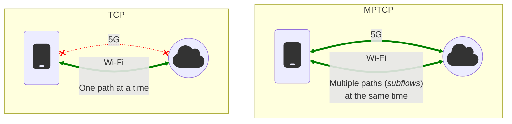
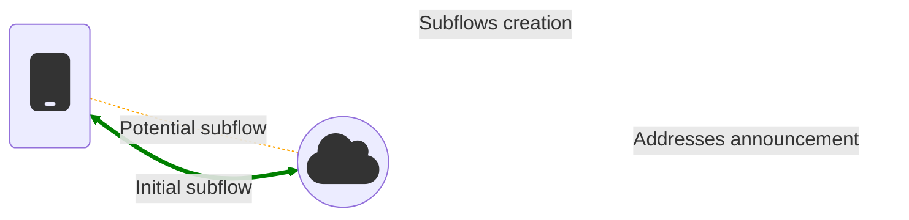
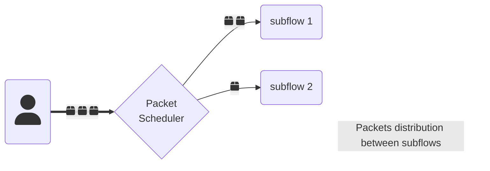

MPTCP | Multipath TCP for Linux                [Skip to main content](#main-content) Link Menu Expand (external link) Document Search Copy Copied

[Multipath TCP for Linux](/)

*   [MPTCP](/)
    *   [Introduction](/#introduction)
    *   [Concepts](/#concepts)
    *   [Features](/#features)
    *   [Communication](/#communication)
    *   [Projects](/#projects)
    *   [Kernel Development](/#kernel-development)
*   [Setup](/setup.html)
    *   [Kernel version](/setup.html#kernel-version)
    *   [Enable MPTCP](/setup.html#enable-mptcp)
    *   [Force applications to use MPTCP](/setup.html#force-applications-to-use-mptcp)
    *   [Using multiple IP addresses](/setup.html#using-multiple-ip-addresses)
*   [Path-Manager](/pm.html)
    *   [In-kernel Path-Manager](/pm.html#in-kernel-path-manager)
    *   [Userspace Path-Manager](/pm.html#userspace-path-manager)
    *   [Notes](/pm.html#notes)
*   [Debugging](/debugging.html)
    *   [ss](/debugging.html#ss)
    *   [ip mptcp](/debugging.html#ip-mptcp)
    *   [nstat](/debugging.html#nstat)
    *   [TCPDump and WireShark](/debugging.html#tcpdump-and-wireshark)
*   [Implementation guide (Devs)](/implementation.html)
    *   [MPTCP socket](/implementation.html#mptcp-socket)
    *   [Examples in different languages](/implementation.html#examples-in-different-languages)
*   [Implementation guide (macOS)](/macOS.html)
    *   [MPTCP with URLSession (iOS only)](/macOS.html#mptcp-with-urlsession-\(ios-only\))
    *   [Examples in different languages on iOS](/macOS.html#examples-in-different-languages-on-ios)
    *   [MPTCP with the Network framework](/macOS.html#mptcp-with-the-network-framework)
    *   [Examples using the Network framework](/macOS.html#examples-using-the-network-framework)
*   [MPTCP info (Devs)](/mptcp-info.html)
    *   [MPTCP socket level](/mptcp-info.html#mptcp-socket-level)
    *   [Per-subflow Information](/mptcp-info.html#per-subflow-information)
    *   [Number of subflows](/mptcp-info.html#number-of-subflows)
    *   [Check for TCP fallback](/mptcp-info.html#check-for-tcp-fallback)
*   [FAQ](/faq.html)
    *   [Are there any security & privacy concerns?](/faq.html#are-there-any-security--privacy-concerns)
    *   [Why & when should MPTCP be enabled by default?](/faq.html#why--when-should-mptcp-be-enabled-by-default)
    *   [Are there any performance impacts when using MPTCP?](/faq.html#are-there-any-performance-impacts-when-using-mptcp)
    *   [Are there unsupported socket options?](/faq.html#are-there-unsupported-socket-options)
    *   [What are the supported operating systems?](/faq.html#what-are-the-supported-operating-systems)
    *   [MPTCP vs. QUIC](/faq.html#mptcp-vs-quic)
    *   [MPTCPv0 vs. MPTCPv1](/faq.html#mptcpv0-vs-mptcpv1)
    *   [What about middleboxes?](/faq.html#what-about-middleboxes)
    *   [How should applications handle missing MPTCP support?](/faq.html#how-should-applications-handle-missing-mptcp-support)
    *   [What build time checks are needed/recommended?](/faq.html#what-build-time-checks-are-neededrecommended)
    *   [Why is `IPPROTO_MPTCP` not defined?](/faq.html#why-is-ipproto_mptcp-not-defined)
    *   [How to check if MPTCP is working?](/faq.html#how-to-check-if-mptcp-is-working)
    *   [How to bootstrap a kernel development environment?](/faq.html#how-to-bootstrap-a-kernel-development-environment)
    *   [High number of retransmissions / dropped packets at the NIX RX queue level?](/faq.html#high-number-of-retransmissions--dropped-packets-at-the-nix-rx-queue-level)
    *   [Is GRO supported with MPTCP?](/faq.html#is-gro-supported-with-mptcp)
    *   [How to enable MPTCP support with OpenSSH?](/faq.html#how-to-enable-mptcp-support-with-openssh)
*   [Support in Apps and Operating Systems](/apps.html)
    *   [Linux apps](/apps.html#linux-apps)
    *   [Linux distributions](/apps.html#linux-distributions)
    *   [Tools](/apps.html#tools)
    *   [macOS apps](/apps.html#macos-apps)
    *   [iOS apps](/apps.html#ios-apps)
    *   [Others?](/apps.html#others)
*   [Implementation details (Kernel)](/details.html)
*   [Contributing](/contributing.html)
    *   [Many ways to contribute](/contributing.html#many-ways-to-contribute)
    *   [Kernel development](/contributing.html#kernel-development)
*   [Deployment behind a load balancer](/load-balancer.html)
    *   [Overview](/load-balancer.html#overview)
    *   [CDNs](/load-balancer.html#cdns)

*   [MPTCP sysctl](https://docs.kernel.org/networking/mptcp-sysctl.html)

[Jekyll theme](https://github.com/just-the-docs/just-the-docs)  
[Improve this page](https://github.com/multipath-tcp/mptcp.dev/edit/main/index.md)

*   [Improve this website](//github.com/multipath-tcp/mptcp.dev)

## Introduction

Multipath TCP or [MPTCP](https://en.wikipedia.org/wiki/Multipath_TCP) is an extension to the standard [TCP](https://en.wikipedia.org/wiki/Transmission_Control_Protocol) and is described in [RFC 8684](https://www.rfc-editor.org/rfc/rfc8684.html). It allows a device to make use of multiple interfaces at once to send and receive TCP packets over a single MPTCP connection. MPTCP can aggregate the bandwidth of multiple interfaces or prefer the one with the lowest latency. It also allows a fail-over if one path is down, and the traffic is seamlessly reinjected on other paths.

### Use cases

Thanks to MPTCP, being able to use multiple paths in parallel or simultaneously brings new use-cases, compared to TCP:

*   Seamless handovers: switching from one path to another while preserving established connections, e.g. Apple is using Multipath TCP on smartphones mainly for this reason since 2013.
*   Best network selection: using the “best” available path depending on some conditions, e.g. latency, losses, cost, bandwidth, etc.
*   Network aggregation: using multiple paths at the same time to have a higher throughput, e.g. to combine fixed and mobile networks to send files faster.

## Concepts

Technically, when a new socket is created with the `IPPROTO_MPTCP` protocol (Linux-specific), a _subflow_ (or _path_) is created. This _subflow_ consists of a regular TCP connection that is used to transmit data through one interface. Additional _subflows_ can be negotiated later between the hosts. For the remote host to be able to detect the use of MPTCP, a new field is added to the TCP _option_ field of the underlying TCP _subflow_. This field contains, amongst other things, a `MP_CAPABLE` option that tells the other host to use MPTCP if it is supported. If the remote host or any [middlebox](https://en.wikipedia.org/wiki/Middlebox) in between does not support it, the returned `SYN+ACK` packet will not contain MPTCP options in the TCP _option_ field. In that case, the connection will be “downgraded” to plain TCP, and it will continue with a single path.

This behavior is made possible by two internal components: the path manager, and the packet scheduler.

### Path Manager

The [Path Manager](pm.html) is in charge of _subflows_, from creation to deletion, and also address announcements. Typically, it is the client side that initiates subflows, and the server side that announces additional addresses via the `ADD_ADDR` and `REMOVE_ADDR` options.

As of Linux v5.19, there are two path managers, controlled by the `net.mptcp.pm_type` sysctl knob: the in-kernel one (type `0`) where the same rules are applied for all the connections (see: `ip mptcp`) ; and the userspace one (type `1`), controlled by a userspace daemon (i.e. [`mptcpd`](https://mptcpd.mptcp.dev/)) where different rules can be applied for each connection.

### Packet Scheduler

The Packet Scheduler is in charge of selecting which available _subflow(s)_ to use to send the next data packet. It can decide to maximize the use of the available bandwidth, only to pick the path with the lower latency, or any other policy depending on the configuration.

As of Linux v6.8, there is only one packet scheduler, controlled by sysctl knobs in `net.mptcp`.

## Features

As of Linux v6.10, major features of MPTCP include:

*   Support of the [`IPPROTO_MPTCP`](implementation.html) protocol in `socket()` system calls.
*   Fallback from MPTCP to TCP if the peer or a middlebox do not support MPTCP.
*   Path management using either an in-kernel or userspace path manager.
*   Socket options that are commonly used with TCP sockets.
*   Debug features including MIB counters, diag support (used by the `ss` command), and tracepoints.

See the [ChangeLog](https://github.com/multipath-tcp/mptcp_net-next/wiki/#changelog) for more details.

## Communication

*   Mailing List: [mptcp@lists.linux.dev](mailto:mptcp@lists.linux.dev) (**plain text only**):
    *   [Archives](https://lore.kernel.org/mptcp)
    *   [Info](https://subspace.kernel.org/lists.linux.dev.html)
    *   Subscribe by sending an empty email **in plain text** to [mptcp+subscribe@lists.linux.dev](mailto:mptcp+subscribe@lists.linux.dev), and by replying to the challenge email.
*   IRC: [#mptcp](https://web.libera.chat/?nick=mptcp-dev-guest?#mptcp) on libera.chat
*   Online [Meetings](https://github.com/multipath-tcp/mptcp_net-next/wiki/Meetings)
*   [Blog](https://blog.mptcp.dev)
*   [Fediverse](https://social.kernel.org/mptcp)

## Projects

*   Maintained by MPTCP community members
    *   [Kernel development on GitHub](https://github.com/multipath-tcp/mptcp_net-next/)
    *   [Multipath TCP Daemon](https://github.com/multipath-tcp/mptcpd)
        *   The [`mptcpd`](https://www.mankier.com/8/mptcpd) daemon can do full userspace path management or control the in-kernel path manager.
        *   Includes the [`mptcpize`](https://www.mankier.com/8/mptcpize) utility to allow legacy TCP binaries to use MPTCP.
    *   [Packetdrill with MPTCP support](https://github.com/multipath-tcp/packetdrill)
*   Projects with MPTCP-related enhancements
    *   [iproute2](https://wiki.linuxfoundation.org/networking/iproute2) (for the [`ip mptcp`](https://www.mankier.com/8/ip-mptcp) command)
    *   [Network Manager](https://networkmanager.dev): MPTCP features are included starting with v1.40.
    *   [Multipath TCP applications](https://github.com/mptcp-apps/): A project to coordinate MPTCP updates for popular TCP applications.

## Kernel Development

*   [Git Repository](https://github.com/multipath-tcp/mptcp_net-next.git) ([branch descriptions](https://github.com/multipath-tcp/mptcp_net-next/wiki/Git-Branches))
*   [Patchwork](https://patchwork.kernel.org/project/mptcp/)
*   [Continuous Integration](https://github.com/multipath-tcp/mptcp_net-next/wiki/CI)
*   [Testing](https://github.com/multipath-tcp/mptcp_net-next/wiki/Testing)
*   [Issue tracker](https://github.com/multipath-tcp/mptcp_net-next/issues)
*   [Contributing](contributing.html)

* * *

[Social](https://social.kernel.org/mptcp)

[Mailing List](https://lore.kernel.org/mptcp)

[Git Repository](https://github.com/multipath-tcp/mptcp_net-next)

[Issue tracker](https://github.com/multipath-tcp/mptcp_net-next/issues)

[Wiki](https://github.com/multipath-tcp/mptcp_net-next/wiki)