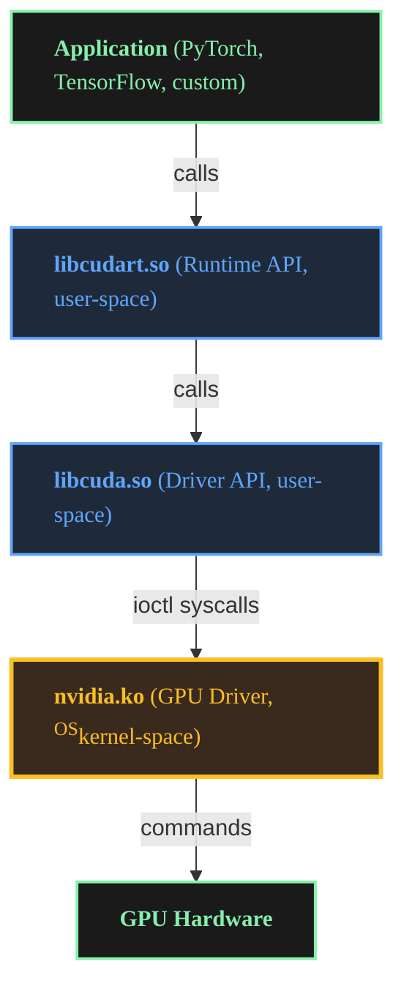

CUDA ontology ~ James Akl

[James Akl](/ "Home")

[](/resume.pdf "Resume")[](https://www.linkedin.com/in/james-akl/ "LinkedIn")[](mailto:james-akl@outlook.com "Email")[](https://scholar.google.com/citations?user=6gPp9TMAAAAJ "Google Scholar")[](/posts "Posts")[](https://github.com/james-akl "GitHub")

# CUDA ontology

CUDA’s terminology carries significant overloading: the word “CUDA” itself refers to at least five distinct concepts, “driver” means different things in different contexts, and version numbers reported by various tools measure different subsystems. This article provides a rigorous ontology of CUDA components: a systematic description of what exists in the CUDA ecosystem, how components relate to each other, their versioning semantics, compatibility rules, and failure modes. Each term is defined precisely to eliminate ambiguity. Understanding this structure is essential for diagnosing version incompatibilities and reasoning about CUDA system behavior.

## Terminology and disambiguation

### The term “CUDA”

`CUDA` is overloaded across at least five distinct meanings:

1.  **CUDA as compute architecture:** The parallel computing platform and programming model designed by NVIDIA.
2.  **CUDA as instruction set:** The GPU instruction set architecture (ISA) supported by NVIDIA hardware, versioned by compute capability (`compute_8.0`, `compute_9.0`, etc.).
3.  **CUDA as source language:** The C/C++ language extensions (`__global__`, `__device__`, etc.) used to write GPU code.
4.  **CUDA Toolkit:** The development package containing `nvcc`, libraries, headers, and development tools.
5.  **CUDA Runtime:** The runtime library (`libcudart`) that applications link against.

When someone says “CUDA version,” they may be referring to toolkit version, runtime version, driver API version, or compute capability. Precision requires explicit qualification.

### The term “kernel”

`kernel` has two completely distinct meanings in GPU computing contexts:

1.  **Operating system kernel (OSkernel):** The OSkernel running in privileged OSkernel-space. Examples: Linux OSkernel (e.g., version `6.6.87`), Windows NT OSkernel, macOS XNU OSkernel.
2.  **CUDA kernel (CUDAkernel):** A C++ function marked with `__global__` that executes on the GPU. When invoked from host code, the CUDAkernel launches as a grid of thread blocks.

Throughout this article, OSkernel always refers to the operating system kernel (Linux, Windows, etc.), and CUDAkernel always refers to GPU functions.

### The term “driver”

In computing, a “driver” is software that allows the operating system to communicate with hardware devices. `driver` in the CUDA context is overloaded between:

1.  **NVIDIA GPU Driver** (also called “NVIDIA Display Driver”): The OSkernel-space driver (OSkernel module on Linux, OSkernel driver on Windows) that manages GPU hardware. Despite the historical name “display driver,” this unified driver handles all GPU operations: graphics rendering, compute workloads, memory management, and scheduling. The name reflects NVIDIA’s evolution from graphics-focused GPUs to general-purpose compute accelerators.
    
    *   Installed as OSkernel modules: `nvidia.ko`, `nvidia-modeset.ko`, `nvidia-uvm.ko` (Linux), or as a Windows OSkernel driver.
    *   Versioned independently: `535.104.05`, `550.54.15`, etc.
2.  **CUDA Driver API**: A low-level C API (`libcuda.so` on Linux, `nvcuda.dll` on Windows) that provides direct access to GPU functionality. This is a user-space library provided by the NVIDIA GPU driver package.
    
    *   Located at: `/usr/lib/x86_64-linux-gnu/libcuda.so` (Linux).
    *   API version distinct from GPU driver version but distributed together in the same driver package.

The NVIDIA GPU driver package includes both OSkernel components (OSkernel modules/drivers) and the `libcuda` user-space library.

## Component architecture

The CUDA ecosystem consists of multiple layers, each with distinct responsibilities. Understanding this layering is fundamental to reasoning about version compatibility and system behavior.

### System layers

The CUDA stack spans OSkernel-space and user-space:



### Component definitions

**`libcuda.so` / `nvcuda.dll`** (Driver API, backend):

*   Provided by the NVIDIA GPU driver package.
*   Installed system-wide:
    *   Linux: `/usr/lib/x86_64-linux-gnu/libcuda.so` (or `/usr/lib64/libcuda.so`)
    *   Windows: `C:\Windows\System32\nvcuda.dll`
*   Provides low-level primitives: `cuInit`, `cuMemAlloc`, `cuLaunchKernel`, etc.
*   Communicates with OSkernel driver via system calls:
    *   Linux: `ioctl` system calls (I/O control syscalls for OSkernel device communication)
    *   Windows: `DeviceIoControl` calls to OSkernel driver
*   Versioned by GPU driver version (e.g., driver `535.x` provides `libcuda.so`/`nvcuda.dll` with CUDA Driver API `12.2`).

**`libcudart.so` / `cudart64_*.dll`** (Runtime API, frontend):

*   Provided by CUDA Toolkit (or bundled with applications like PyTorch).
*   File locations:
    *   Linux: `libcudart.so` (shared), `libcudart_static.a` (static)
    *   Windows: `cudart64_<version>.dll` (shared), `cudart_static.lib` (static)
*   Higher-level API: `cudaMalloc`, `cudaMemcpy`, `cudaLaunchKernel`, etc.
*   Internally calls `libcuda.so`/`nvcuda.dll` (Driver API) to perform operations.
*   Can be statically linked or dynamically linked.
*   Application code typically uses Runtime API, not Driver API directly.

**CUDA Toolkit**:

*   Development package containing:
    *   `nvcc`: Compiler for CUDAkernel code
    *   `libcudart`/`cudart64_*.dll`: Runtime library
    *   Headers (`cuda.h`, `cuda_runtime.h`)
    *   Math libraries: `cuBLAS`, `cuDNN`, `cuFFT`, etc.
    *   Profiling and debugging tools: `nvprof`, `nsight`, `cuda-gdb`
*   Versioned independently from GPU driver: toolkit `12.1`, `12.4`, etc.
*   Required at build time to compile CUDAkernel code.
*   Runtime library (`libcudart`) required at execution time, but `nvcc` and headers are not.
*   Installation paths:
    *   Linux: `/usr/local/cuda/` (default)
    *   Windows: `C:\Program Files\NVIDIA GPU Computing Toolkit\CUDA\v12.x\`

**NVIDIA GPU Driver**:

*   Operating system-level driver software managing GPU hardware.
*   Provides OSkernel modules (`nvidia.ko` on Linux, OSkernel driver on Windows) and user-space library (`libcuda.so` on Linux/macOS, `nvcuda.dll` on Windows).
*   Must be installed on all machines running CUDA applications.
*   Supports a range of CUDA Runtime API versions via forward compatibility (newer driver supports older runtime versions).
*   **Note:** NVIDIA deprecated CUDA support for macOS as of CUDA 10.2 (2019). Modern CUDA development targets Linux and Windows.

### Layered architecture model

The CUDA stack separates concerns between application-facing and system-facing layers:

*   **Frontend (application layer):** `libcudart.so` + application code. Provides high-level Runtime API (`cudaMalloc`, `cudaMemcpy`, etc.). Bundled with or linked by applications.
*   **Backend (system layer):** `libcuda.so` + GPU driver (`nvidia.ko`). Provides low-level Driver API and hardware management. Installed system-wide, must be present at execution time.

This separation allows applications to use a consistent high-level API while the backend handles hardware-specific details. `libcudart` translates Runtime API calls into Driver API calls, which `libcuda` executes via the OSkernel driver.

### Build-time vs. execution-time components

**Note on terminology:** Execution-time refers to when the application runs (at runtime). This is distinct from the Runtime API (`libcudart`), which is a specific CUDA library required at execution-time.

Component

Build-time (compilation)

Execution-time (at runtime)

`nvcc`

Required to compile CUDAkernel code

Not required

CUDA headers (`cuda.h`, etc.)

Required

Not required

`libcudart` (Runtime API)

Required to link application

Required to run application

`libcuda` (Driver API)

Not directly used

Required (system-wide)

GPU driver (`nvidia.ko`)

Not required

Required

**Example:** PyTorch compilation:

*   PyTorch is compiled against CUDA Toolkit `12.1` (meaning the build process links to and uses headers from toolkit `12.1`).
*   At build time: `nvcc`, headers, and `libcudart` from toolkit `12.1` are used.
*   At execution time: PyTorch bundles or depends on `libcudart.so` (often statically linked or packaged), and calls `libcuda.so` provided by the system’s GPU driver.
*   The system must have a GPU driver that supports CUDA Driver API version ≥ the version PyTorch expects (≥ `12.1` in this example).

## Version semantics

The CUDA ecosystem has multiple independent versioning schemes. Each version number measures a different aspect of the system. Conflating these versions is a primary source of confusion.

### Compute capability

Compute capability (CC) defines the GPU’s instruction set and hardware features. This is a property of the GPU hardware itself, not software:

*   Format: `X.Y` where `X` = major version, `Y` = minor version (e.g., `8.0`, `9.0`).
*   Determined by GPU hardware: RTX 4090 has CC `8.9`, H100 has CC `9.0`.
*   Query compute capability via `nvidia-smi` or `cudaGetDeviceProperties()`.

GPU code can be compiled to two forms:

*   **SASS (Shader Assembly):** GPU-specific machine code compiled for a specific compute capability. Executable directly on hardware matching that CC, but not portable across different CCs.
*   **PTX (Parallel Thread Execution):** NVIDIA’s virtual instruction set architecture (ISA) and intermediate representation. Platform-independent bytecode that can be JIT-compiled (Just-In-Time compiled) by the driver at execution time to SASS for any supported GPU architecture.

**Binary compatibility rules:**

SASS (compiled machine code) has strict compatibility constraints:

*   **Binary compatibility is NOT guaranteed between different compute capabilities.** SASS compiled for CC `8.0` will generally NOT run on CC `8.6` hardware, even though both are major version 8.x. Each compute capability may have different instruction encoding.
*   **SASS cannot run on older hardware:** SASS for CC `8.0` will NOT run on CC `7.5` hardware (older hardware lacks required instructions).
*   **SASS cannot run across major versions:** SASS for CC `8.0` will NOT run on CC `9.0` hardware (different major version, different ISA).

PTX (intermediate representation) provides forward compatibility:

*   **PTX is portable across compute capabilities:** PTX compiled for CC `8.0` can be JIT-compiled by the driver at execution time to native SASS for any supported GPU architecture (CC `8.6`, `8.9`, `9.0`, etc.).
*   **Requirements:** The binary must include PTX, and the driver must support the target GPU architecture.
*   **Performance consideration:** JIT compilation incurs a one-time cost at first CUDAkernel launch. Pre-compiled SASS avoids this cost.
*   **Recommendation:** Include both SASS for known target architectures and PTX for forward compatibility with future GPUs.

### GPU driver version

Format (Linux): `R.M.P` (e.g., `535.104.05`, `550.54.15`).

*   R: Major release (corresponds to CUDA Driver API major version support)
*   M: Minor release
*   P: Patch

Format (Windows): Display driver uses different versioning (e.g., `31.0.15.3623`), but CUDA components report similar `R.M` versioning.

Each driver version supports a maximum CUDA Driver API version. For example:

*   Driver `535.x` supports CUDA Driver API `12.2`
*   Driver `550.x` supports CUDA Driver API `12.4`

**Critical:** Driver version determines maximum CUDA Driver API version, which must be ≥ Runtime API version used by applications.

Query driver version and maximum supported CUDA Driver API version via `nvidia-smi`.

### CUDA Toolkit version

Format: `X.Y.Z` (e.g., `12.1.0`, `12.4.1`).

*   Corresponds to the toolkit package version installed during development.
*   Determines `nvcc` version, `libcudart` version, and available API features.
*   Query toolkit version via `nvcc --version` (requires toolkit installation).

### CUDA Runtime API version

*   The API version supported by `libcudart`.
*   Typically matches toolkit version (toolkit `12.1` provides `libcudart` with Runtime API `12.1`).
*   Applications may bundle a specific `libcudart` version.
*   Query runtime API version via `cudaRuntimeGetVersion()` in application code.

### CUDA Driver API version

*   The API version provided by `libcuda.so`.
*   Determined by GPU driver version.
*   Must be ≥ the Runtime API version used by the application.
*   Query Driver API version via `cudaDriverGetVersion()` in application code, or via `nvidia-smi` (shown as “CUDA Version”).

### PyTorch CUDA versions

When PyTorch reports CUDA version, it refers to:

*   **Build-time toolkit version:** The CUDA Toolkit version PyTorch was compiled against (the build process linked to this version). Queried via `torch.version.cuda` (e.g., `"12.1"`).
*   **Runtime driver version:** The CUDA Driver API version available on the system at runtime. Queried via `torch.cuda.is_available()` and driver checks.

PyTorch may be compiled against toolkit `12.1` (linked at build time) but run on a system with driver supporting CUDA Driver API `12.4`. This is valid as long as Driver API version ≥ toolkit’s CUDA version (12.4 ≥ 12.1).

## Version compatibility

Version compatibility in CUDA follows specific rules. Understanding these rules is critical for ensuring applications run correctly across different systems.

**Terminology note:** Compatibility is described from the perspective of the backend (driver + GPU hardware). “Forward compatible” means the backend can work with frontends built against older toolkit versions (example: driver version 12.4 works with libcudart from toolkit 12.1). “Backward compatible” means the backend can work with frontends built against newer toolkit versions (example: driver version 12.1 working with libcudart from toolkit 12.4). CUDA drivers are forward compatible (support older frontend versions) but not backward compatible (cannot support newer frontend versions).

### Forward compatibility: older frontend on newer backend

CUDA maintains forward compatibility in specific dimensions:

**Driver API is forward-compatible with Runtime API:**

*   A driver supporting CUDA Driver API `12.4` can run applications built with Runtime API `12.1`, `12.2`, `12.3`, or `12.4`.
*   Newer drivers support older runtime versions.
*   Applications run on systems with newer drivers without recompilation.

**PTX provides forward compatibility across compute capabilities:**

*   PTX compiled for CC `8.0` can be JIT-compiled by the driver to run on CC `8.6`, `8.9`, or `9.0` hardware (across major version boundaries).
*   Requirements: Binary must include PTX, and driver must support target GPU.
*   Applications can run on newer GPUs without recompilation, at the cost of JIT compilation overhead.

### Backward compatibility: newer frontend on older backend

Backward compatibility is not supported in CUDA:

**Driver API cannot support newer Runtime API:**

*   A driver supporting CUDA Driver API `12.1` cannot run applications requiring Runtime API `12.4`.
*   Older drivers do not support newer runtime versions.
*   **Resolution:** Upgrade GPU driver to support required Driver API version.

**SASS cannot run on older hardware:**

*   SASS compiled for CC `8.0` will not run on CC `7.5` hardware (older GPU lacks instructions).
*   **Resolution:** Recompile for older compute capability, or include PTX for JIT compilation.

**SASS is not portable across compute capabilities:**

*   SASS compiled for CC `8.0` will generally not run on CC `8.6` or `9.0` hardware.
*   **Resolution:** Include PTX in binary for forward compatibility, or compile SASS for all target architectures.

### Compatibility requirements

For a CUDA application to execute successfully, two independent conditions must be satisfied:

**Condition 1: API version compatibility**

```
Driver API version ≥ Runtime API version
```

The Driver API version (provided by `libcuda.so`, determined by GPU driver) must be greater than or equal to the Runtime API version (provided by `libcudart`, bundled with or linked by application).

**Condition 2: GPU code availability**

At least one of the following must be true:

```
Binary contains SASS for GPU's compute capability
  OR
Binary contains PTX AND driver supports JIT compilation for GPU's architecture
```

The application binary must contain executable GPU code. This can be either:

*   Pre-compiled SASS matching the GPU’s compute capability (fastest execution, no JIT overhead)
*   PTX intermediate representation that the driver can JIT-compile to SASS (enables forward compatibility, incurs one-time JIT cost)

**Common failure modes:**

*   `cudaErrorInsufficientDriver`: Condition 1 violated (Driver API version < Runtime API version)
*   `cudaErrorNoKernelImageForDevice`: Condition 2 violated (no SASS or PTX available for GPU)

## Diagnostic tools and version reporting

Different tools report different version numbers. Understanding what each tool measures is essential for diagnosing compatibility issues.

### `nvidia-smi`

`nvidia-smi` (NVIDIA System Management Interface) queries the GPU driver and reports driver-related information.

**Reports:**

*   GPU driver version (e.g., `535.104.05`)
*   Maximum supported CUDA Driver API version (e.g., `12.2`)
*   GPU model (e.g., “NVIDIA GeForce RTX 4090”)
*   Compute capability (can be queried with `nvidia-smi --query-gpu=compute_cap --format=csv`)

**Does NOT report:**

*   CUDA Toolkit version (toolkit may not be installed on the system)
*   Runtime API version used by applications
*   `nvcc` compiler version

**Example output:**

```
Driver Version: 535.104.05    CUDA Version: 12.2
```

*   `535.104.05`: GPU driver version installed on the system
*   `12.2`: Maximum CUDA Driver API version this driver supports (applications requiring ≤ 12.2 can run)

### `nvcc --version`

**Reports:**

*   CUDA Toolkit version installed (e.g., `12.1.0`).
*   `nvcc` compiler version (matches toolkit).

**Does not report:**

*   GPU driver version.
*   Runtime API version currently in use.
*   Driver API version currently in use.

**May not be available if:**

*   CUDA Toolkit is not installed (only driver installed).
*   Application bundles `libcudart` but not full toolkit.
*   Running in a container without toolkit (runtime-only image).

### `torch.version.cuda`

**Reports:**

*   CUDA Toolkit version PyTorch was compiled against (e.g., `"12.1"`).

**Does not report:**

*   Driver version.
*   Runtime driver API version available on the system.

### `torch.cuda.is_available()`

**Reports:**

*   Whether PyTorch can access a CUDA-capable GPU.
*   Requires compatible driver and runtime.

Returns boolean indicating CUDA availability. Failure indicates version mismatch or missing driver.

### `cudaRuntimeGetVersion()` and `cudaDriverGetVersion()`

Queried programmatically in application code:

*   `cudaRuntimeGetVersion()`: Runtime API version (from `libcudart`).
*   `cudaDriverGetVersion()`: Driver API version (from `libcuda`).

**Example:**

```c
int runtimeVersion, driverVersion;
cudaRuntimeGetVersion(&runtimeVersion);  // e.g., 12010 (12.1)
cudaDriverGetVersion(&driverVersion);    // e.g., 12040 (12.4)
```

## Compilation and execution model

### Compilation pipeline

When compiling CUDA code:

1.  **Source code (`.cu` file):** Contains CUDAkernel definitions (`__global__` functions) and host code.
    
2.  **`nvcc` compilation:**
    
    *   Separates device code (GPU) from host code (CPU).
    *   Device code compiled to PTX (intermediate representation) and/or SASS (GPU machine code) for specified compute capabilities.
    *   Host code compiled with host compiler (e.g., `g++`, `cl.exe` on Windows).
3.  **Linking:**
    
    *   Object files linked with `libcudart` (Runtime API).
    *   Resulting binary contains host code and embedded GPU code (PTX/SASS).

**Compute capability targeting:** `nvcc` uses `-arch` and `-code` flags:

*   `-arch=compute_XY`: Sets the virtual architecture (PTX feature level). Determines which CUDA features are available during compilation.
*   `-code=sm_XY`: Generates SASS (native machine code) for specific GPU architecture CC X.Y.
*   `-code=compute_XY`: Embeds PTX for CC X.Y in the binary for forward compatibility.
*   Multiple `-code` targets can be comma-separated.

**Default behavior:** If only `-arch=compute_XY` is specified without `-code`, `nvcc` implicitly generates both `sm_XY` SASS and `compute_XY` PTX for that architecture.

**Best practice:** Always specify both `-arch` (virtual architecture) and `-code` (real architectures). While `-code` can be used without `-arch`, `nvcc` will infer the PTX level, which may not be the intended behavior.

**Example:**

```bash
nvcc -arch=compute_80 -code=sm_80,sm_86,sm_89,compute_80 kernel.cu -o app
```

This generates four outputs:

*   SASS for CC `8.0` (A100), `8.6` (RTX 3090/3080), `8.9` (RTX 4090/4080)
*   PTX for CC `8.0` for forward compatibility with future GPUs

At execution time:

*   On A100 (CC 8.0): Loads sm\_80 SASS directly
*   On RTX 3090 (CC 8.6): Loads sm\_86 SASS directly
*   On RTX 4090 (CC 8.9): Loads sm\_89 SASS directly
*   On H100 (CC 9.0): No matching SASS, so driver JIT-compiles PTX for CC 8.0 to SASS for CC 9.0

### Execution model

When the application executes:

1.  Application calls `cudaMalloc`, `cudaMemcpy`, `cudaLaunchKernel`, etc. (Runtime API).
2.  `libcudart` translates these to Driver API calls (`cuMemAlloc`, `cuMemcpyHtoD`, `cuLaunchKernel`).
3.  `libcuda.so` communicates with OSkernel driver via `ioctl` syscalls.
4.  Driver schedules CUDAkernel execution on GPU hardware.
5.  GPU executes CUDAkernel (SASS instructions), processes data, returns results.

**What is being transmitted:** When CUDAkernel code is “launched,” the host does not send C++ source code to the GPU. Instead:

*   Pre-compiled GPU machine code (SASS) or PTX is embedded in the application binary (created at compile time by `nvcc`).
*   At application startup, the driver loads the appropriate code into GPU memory:
    *   If SASS matching the GPU’s compute capability exists, driver loads SASS directly.
    *   If only PTX is available, driver JIT-compiles PTX to SASS for the GPU’s architecture, then loads it.
*   At CUDAkernel launch, the host specifies:
    *   Grid/block dimensions (how many thread blocks, how many threads per block)
    *   CUDAkernel parameters (function arguments passed to CUDAkernel)
    *   Shared memory size
*   The GPU’s hardware scheduler executes the SASS code across thread blocks.

The execution model is not RPC (Remote Procedure Call) in the network sense, but shares conceptual similarities:

*   **Command submission:** Host enqueues commands (CUDAkernel launch, memory transfer) into a command buffer.
*   **Driver interpretation:** Driver translates commands into GPU-specific operations.
*   **Asynchronous execution:** GPU executes independently; host can continue or synchronize via `cudaDeviceSynchronize()`.

The programming model resembles remote execution: host code invokes operations on a separate processor (GPU) with its own memory space and instruction set.

## Version mismatch scenarios

### Scenario 1: Runtime version > Driver version

**Setup:**

*   GPU driver supports CUDA Driver API `12.1`.
*   Application built with Runtime API `12.4`.

**Result:**

*   Application calls `libcudart` (Runtime API version `12.4`).
*   `libcudart` calls `libcuda.so` (Driver API version `12.1`, provided by GPU driver).
*   `libcuda.so` does not support newer Driver API features required by Runtime API `12.4`.
*   **Failure:** Application crashes or returns `cudaErrorInsufficientDriver`.

**Possible solutions:** Upgrade GPU driver to version supporting CUDA Driver API ≥ `12.4`.

### Scenario 2: Compiled compute capability > GPU compute capability

**Setup:**

*   Code compiled for CC `8.0` (e.g., A100).
*   Running on CC `7.5` hardware (e.g., RTX 2080 Ti).

**Result:**

*   Driver attempts to load CUDAkernel code for CC `8.0`.
*   GPU does not support CC `8.0` instructions.
*   **Failure:** `cudaErrorNoKernelImageForDevice` or similar.

**Possible solutions:**

*   Recompile code for CC `7.5` (`-arch=compute_75`).
*   Or include PTX in binary for JIT compilation (`-arch=compute_75` without `sm_` code).

### Scenario 3: Missing PTX for forward compatibility

**Setup:**

*   Code compiled with `-code=sm_80` (SASS only for CC `8.0`, no PTX included).
*   Running on newer GPU with CC `9.0` (e.g., H100).

**Result:**

*   Binary contains only SASS for CC `8.0`.
*   No PTX available for JIT compilation.
*   SASS for CC `8.0` is incompatible with CC `9.0` (different major version, different ISA).
*   **Failure:** `cudaErrorNoKernelImageForDevice` - no compatible CUDAkernel image found in binary.

**Possible solutions:**

*   Recompile with PTX included: `-arch=compute_80 -code=sm_80,compute_80`.
*   The `compute_80` in `-code` ensures PTX is embedded in the binary.
*   At execution time on CC `9.0` hardware, driver JIT-compiles the PTX to SASS for CC `9.0`.

### Scenario 4: PyTorch toolkit version vs. driver version

**Setup:**

*   PyTorch compiled against CUDA Toolkit `12.1`.
*   System driver supports CUDA `12.4`.

**Result:**

*   PyTorch bundles or links `libcudart` (version `12.1`).
*   Driver provides `libcuda.so` (version `12.4`).
*   `12.4 ≥ 12.1`: **Success.** No issue.

**Setup (reverse):**

*   PyTorch compiled against CUDA Toolkit `12.4`.
*   System GPU driver supports CUDA Driver API `12.1`.

**Result:**

*   PyTorch runtime calls require Driver API `12.4` features.
*   `libcuda.so` (Driver API version `12.1`) does not support them.
*   **Failure:** `cudaErrorInsufficientDriver` or runtime error.

**Possible solutions:** Upgrade GPU driver to version supporting CUDA Driver API ≥ `12.4`.

### Scenario 5: Multiple CUDA toolkits installed

**Setup:**

*   System has toolkit `12.1` at `/usr/local/cuda-12.1`.
*   System has toolkit `12.4` at `/usr/local/cuda-12.4`.
*   `PATH` points to `/usr/local/cuda-12.1/bin`.
*   Application compiled with toolkit `12.4`.

**Result:**

*   `nvcc --version` reports `12.1` (from `PATH`).
*   Application uses `libcudart` from toolkit `12.4`.
*   Version reported by `nvcc` does not match application runtime.

**Note:** `nvcc --version` reports the toolkit in `PATH`, not the toolkit used by applications. Applications may bundle or link against a different toolkit version.

**Possible solutions:** Check application’s linked libraries (`ldd ./app`) to determine actual `libcudart` version.

### Scenario 6: Docker container with CUDA runtime but no toolkit

**Setup:**

*   Container image based on `nvidia/cuda:12.1-runtime`.
*   Application requires `nvcc` to compile CUDAkernel code at runtime.

**Result:**

*   Runtime image includes `libcudart`, but not `nvcc` or headers.
*   **Failure:** `nvcc` not found.

**Possible solutions:**

*   Use `nvidia/cuda:12.1-devel` image, which includes full toolkit.
*   Or install toolkit separately in runtime image.

**Note:** Runtime vs. devel images:

*   **Runtime (`-runtime`):** Includes `libcudart` and libraries needed to run CUDA applications. Does not include `nvcc` or headers.
*   **Devel (`-devel`):** Includes full toolkit (`nvcc`, headers, libraries) for compiling CUDA code.

### Scenario 7: Static vs. dynamic linking of `libcudart`

**Setup:**

*   Application statically links `libcudart_static.a` (toolkit `12.1`).
*   System driver supports CUDA `12.4`.

**Result:**

*   Application contains embedded `libcudart` code (version `12.1`).
*   `libcudart` calls `libcuda.so` (version `12.4`).
*   `12.4 ≥ 12.1`: **Success.**

**Setup (reverse):**

*   Application statically links `libcudart_static.a` (toolkit `12.4`).
*   System driver supports CUDA `12.1`.

**Result:**

*   Embedded `libcudart` (version `12.4`) calls `libcuda.so` (version `12.1`).
*   `12.1 < 12.4`: **Failure.**

**Note:** Static linking bundles `libcudart` into the application binary. The version used is determined at build time, not runtime. Dynamic linking allows runtime version selection via library search paths (`LD_LIBRARY_PATH` on Linux, `PATH` on Windows) or system libraries.

## Summary of component relationships

Component

Provided by

Location (Linux / Windows)

Purpose

Version

OSkernel driver

NVIDIA GPU driver

OSkernel-space: `nvidia.ko` / `nvlddmkm.sys`

Manage GPU hardware

Driver

Driver API library

NVIDIA GPU driver

`/usr/lib/libcuda.so` / `System32\nvcuda.dll`

Driver API (low-level)

Driver

Runtime library

CUDA Toolkit

`/usr/local/cuda/lib64` / `CUDA\v12.x\bin`

Runtime API (high-level)

Toolkit

`nvcc`

CUDA Toolkit

`/usr/local/cuda/bin` / `CUDA\v12.x\bin`

Compile CUDAkernel

Toolkit

Headers

CUDA Toolkit

`/usr/local/cuda/include` / `CUDA\v12.x\include`

Build-time API definitions

Toolkit

Math libraries

CUDA Toolkit

`/usr/local/cuda/lib64` / `CUDA\v12.x\lib`

Optimized GPU operations

Toolkit

## Practical guidelines

### For application developers

*   **Specify minimum driver version:** Document required CUDA Driver API version.
*   **Bundle or specify runtime version:** If statically linking `libcudart`, ensure driver compatibility. If dynamically linking, document required `libcudart` version.
*   **Compile for multiple compute capabilities:** Use `-arch` and `-code` flags to support a range of GPUs. Include PTX for forward compatibility.
*   **Check versions at runtime:** Use `cudaDriverGetVersion()` and `cudaRuntimeGetVersion()` to verify compatibility.

### For end users

*   **Install appropriate GPU driver:** Ensure GPU driver supports CUDA Driver API version ≥ application’s runtime requirement.
*   **Toolkit installation optional at runtime:** Most applications do not require full toolkit (no need for `nvcc`). Only `libcudart` and GPU driver are necessary.
*   **Check compatibility:** Run `nvidia-smi` to verify GPU driver version and supported CUDA Driver API version.

### For PyTorch users

*   **Build-time toolkit version (`torch.version.cuda`):** The CUDA Toolkit version PyTorch was compiled against (linked at build time). Does not need to match system toolkit.
*   **Runtime driver version:** System GPU driver must support CUDA Driver API ≥ PyTorch’s toolkit version.
*   **Example:**
    *   PyTorch built with CUDA Toolkit `12.1`: System GPU driver must support CUDA Driver API ≥ `12.1`.
    *   System GPU driver supports CUDA Driver API `12.4`: Can run PyTorch built with CUDA Toolkit `12.1`, `12.2`, `12.3`, or `12.4`.

**Note:** TensorFlow follows the same compatibility model. Check release notes for build toolkit version.

### For Docker/container users

*   **Runtime-only images (`-runtime`):** Include `libcudart` and libraries. Suitable for running pre-compiled CUDA applications. Do not include `nvcc`.
*   **Development images (`-devel`):** Include full CUDA Toolkit (`nvcc`, headers, libraries). Required for compiling CUDA code.
*   **NVIDIA Container Toolkit:** Ensures container has access to host GPU and GPU driver. GPU driver version on host determines maximum CUDA Driver API version available to container.

## Conclusion

CUDA’s architecture is a layered system with distinct components serving different roles at build-time and execution-time. Rigorous understanding requires:

1.  **Disambiguation:** “CUDA” refers to architecture, ISA, language, toolkit, or runtime. “Driver” refers to OSkernel-space driver (`nvidia.ko`) or user-space Driver API library (`libcuda.so`). “Kernel” refers to operating system kernel (OSkernel) or GPU function (CUDAkernel).
    
2.  **Layering:** `libcudart` (frontend, Runtime API, application-facing) calls `libcuda` (backend, Driver API, system-facing), which calls OSkernel driver (`nvidia.ko`), which manages GPU hardware.
    
3.  **Versioning:** Driver API version must be ≥ Runtime API version. GPU must have SASS for its compute capability OR binary must include PTX that driver can JIT-compile.
    
4.  **Build vs. execution:** Toolkit (including `nvcc`) required at build-time. Execution requires only `libcudart` (bundled or linked) and system GPU driver.
    

Version mismatches produce specific failure modes: insufficient driver errors, missing CUDAkernel images, or unsupported API calls. This systematic understanding clarifies why `nvidia-smi`, `nvcc --version`, and `torch.version.cuda` report different numbers, what each number signifies, and how to diagnose version incompatibilities.

Published 2025-11-15 · Opinions are mine and do not reflect the views of affiliates.