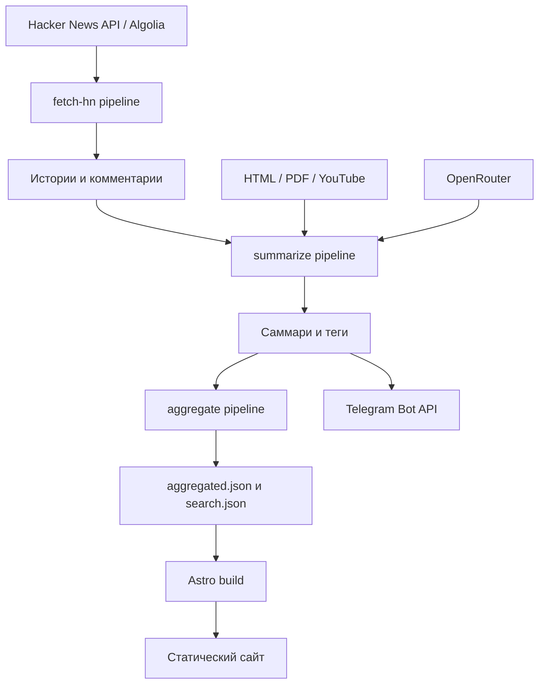
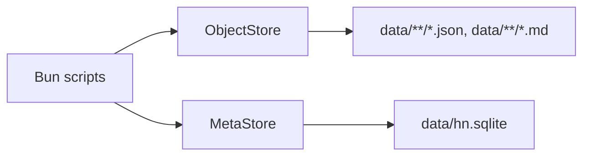
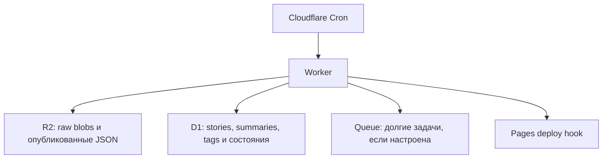
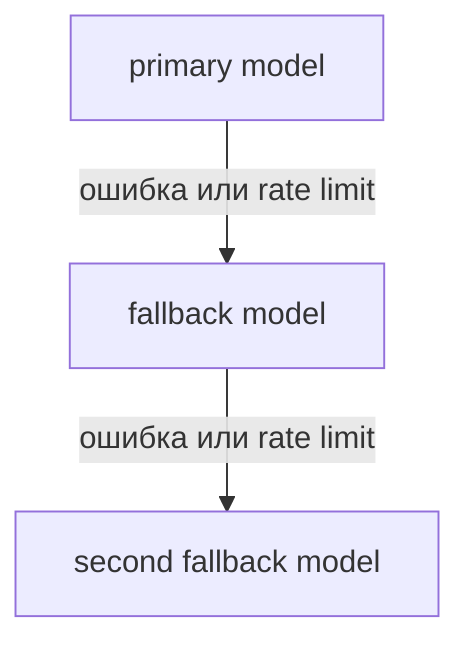
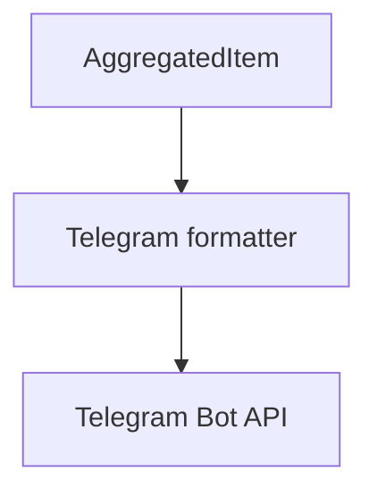
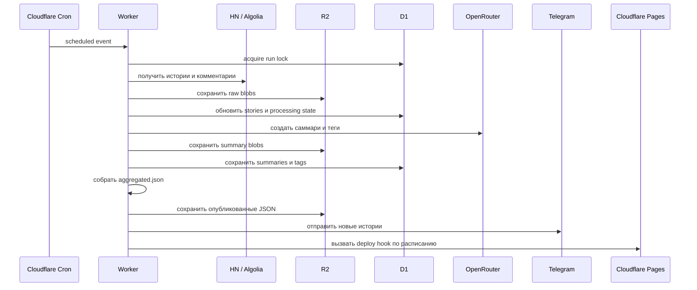
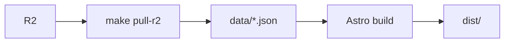

# Архитектура hn-distill

> Состояние: описание текущей реализации (as-is). Последняя проверка: 10 июля 2026 года.

## Назначение

`hn-distill` — это периодический data pipeline, который:

1. забирает популярные посты и комментарии Hacker News;
2. извлекает содержимое статей;
3. создаёт LLM-саммари и теги;
4. собирает единый набор публикаций;
5. генерирует статический Astro-сайт;
6. опционально публикует записи в Telegram.

Это не обычное web-приложение с backend API. Обработка данных выполняется заранее, а пользователь получает готовые HTML-файлы.



## Основные архитектурные блоки

### Pipeline

Основная бизнес-логика находится в `pipeline/`:

- `pipeline/fetch-hn.ts` — получение историй и комментариев;
- `pipeline/summarize.ts` — извлечение контента и LLM-обработка;
- `pipeline/aggregate.ts` — формирование данных для публикации.

Pipeline не привязан напрямую к файловой системе или Cloudflare. Он работает через две абстракции:

- `ObjectStore` — хранение JSON, Markdown и других blobs;
- `MetaStore` — структурированное состояние, индексы и ledger.

Благодаря этому одна и та же бизнес-логика запускается локально и в Cloudflare Worker.

### Локальный runtime

CLI-обёртки находятся в `scripts/`:

```text
scripts/fetch-hn.mts
scripts/summarize.mts
scripts/aggregate.mts
```

Они подключают:

- `createFsStore()` — файлы в `data/`;
- `openLocalMetaStore()` — SQLite в `data/hn.sqlite`.

Полный локальный запуск:

```bash
bun run data:all
```

Локальная схема хранения:



### Cloudflare runtime

Облачный entry point — `worker/src/index.ts`.

По `wrangler.toml` Worker запускается каждый час:

```toml
[triggers]
crons = ["0 * * * *"]
```

В Cloudflare используются:

- **R2** как `ObjectStore`;
- **D1** как `MetaStore`;
- опциональная **Cloudflare Queue** для фоновой суммаризации и Telegram;
- deploy hook для запуска сборки Cloudflare Pages.



В текущем `wrangler.toml` Queue binding не указан. Поэтому Worker выполняет ограниченное число суммаризаций inline, соблюдая timeout.

## Обработка одной истории

### 1. Выбор постов

`pipeline/fetch-hn.ts` поддерживает два режима:

- `topstories` — первые `TOP_N` идентификаторов из HN API;
- `daily-top-by-score` — истории за UTC-день через Algolia с последующей сортировкой по HN score.

После выбора pipeline получает каждую историю через HN API:

```text
https://hacker-news.firebaseio.com/v0/item/{id}.json
```

Внешние данные проверяются через Zod-схемы из `config/schemas.ts`.

### 2. Получение комментариев

Комментарии обходятся по дереву с ограничениями:

- `MAX_DEPTH`;
- `MAX_COMMENTS_PER_STORY`;
- `CONCURRENCY`.

HTML из комментариев преобразуется в plain text. История и комментарии сохраняются отдельно:

```text
data/raw/items/{id}.json
data/raw/comments/{id}.json
```

`data/cache/seen.json` помогает отслеживать уже встречавшиеся комментарии.

### 3. Извлечение статьи

Для ссылки истории определяется тип контента:

- HTML: из полной страницы через `@mozilla/readability` (на pure-JS DOM `linkedom`, совместимом с workerd — не `jsdom`) извлекается **основная статья**, затем turndown → Markdown. Если Readability не находит статью, откат к конвертации всей страницы;
- PDF преобразуется в текст;
- для YouTube запрашивается transcript;
- неизвестный текстовый формат декодируется как plain text.

Только для HTML извлечённый Markdown проходит дешёвый детектор мусора (`utils/extract-quality.ts`, без LLM): доля ссылок, объём связного текста, повторяемость строк. Если это навигация / cookie-баннер / футер / ссылочная ферма, вердикт `no-article` записывается в `article_extracts.status`. PDF / transcript / plaintext детектор пропускают (списки и короткие строки там легитимны). Пороги: `EXTRACT_MIN_PROSE_CHARS`, `EXTRACT_MAX_LINK_DENSITY`, `EXTRACT_MAX_DUP_RATIO`.

Извлечённый контент кэшируется:

```text
data/raw/articles/{id}.md
```

Повторный запуск использует кэш и не скачивает статью заново.

### 4. Суммаризация

Для каждой истории создаются:

1. саммари статьи;
2. саммари комментариев;
3. канонические теги.

OpenRouter вызывается с цепочкой fallback-моделей:



Если статья помечена `no-article`, LLM для поста **не вызывается**: пишется вырожденный stub (`summary: ""`, `degraded: "no-article"`), а любое устаревшее опубликованное саммари ретайрится пустым `upsertSummary` (оба агрегатора отбрасывают пустые саммари постов). Саммари комментариев при этом создаётся как обычно.

Для длинных статей в prompt идёт голова + хвост: первые `ARTICLE_HEAD_CHARS` символов и последние `ARTICLE_SLICE_CHARS - ARTICLE_HEAD_CHARS`, чтобы не терять выводы в конце.

Саммари статьи дополнительно проходит:

- эвристические проверки;
- повторные попытки с более строгим prompt;
- опциональный LLM guard;
- очистку артефактов модели.

Некорректное саммари не публикуется.

`inputHash` поста включает код-константу `EXTRACT_POLICY_VERSION`: её увеличение инвалидирует все кэшированные саммари постов и заставляет их пересобраться.

Результаты сохраняются как blobs:

```text
data/summaries/{id}.post.json
data/summaries/{id}.comments.json
data/summaries/{id}.tags.json
```

При наличии `MetaStore` результаты также записываются в SQLite или D1 как структурированные записи.

## Инкрементальность и идемпотентность

Pipeline рассчитан на регулярные повторные запуски. Для этого используются:

- `inputHash` — саммари пересоздаётся только при изменении входных данных;
- `seen.json` — отслеживание комментариев;
- `processing_state` — состояние обработки каждой истории;
- `aggregate_state` — признак необходимости пересборки агрегата;
- `telegram_ledger` — защита от повторной отправки;
- `run_lock` — защита от параллельных cron-запусков;
- cooldown и лимиты количества историй за один запуск.

Файлы также не перезаписываются, если их содержимое не изменилось.

### Миграция извлечения (автоматическая)

Кэшированный `data/raw/articles/{id}.md` от старого пайплайна — это turndown всей страницы. Такие записи в `article_extracts` не имеют `source_kind`, поэтому `getOrFetchArticleMarkdown` при cache-hit распознаёт их как legacy и **пере-скачивает статью** (Readability + детектор), перезаписывая кэш на месте — одинаково для FS (локально) и R2 (worker). Пересборка саммари включается через `EXTRACT_POLICY_VERSION` в `inputHash`. Изменение порогов детектора применяется на лету: для `source_kind='html'` вердикт пересчитывается на кэшированном markdown без повторного скачивания.

Для worker нужно лишь дать истории пере-выбраться (`listPendingStoryIds` исключает `post_status='ok'`):

```bash
bunx wrangler d1 execute hn_distill --remote \
  --command "UPDATE processing_state SET post_status='missing'"
```

`scripts/backfill-extraction.mts` — опциональный инструмент, только для точечного форс-рефетча конкретных историй на FS-топологии без bump'а политики.

## Хранение данных

Данные разделены на blobs и структурированное состояние.

| Хранилище | Локально | Cloudflare | Содержимое |
|---|---|---|---|
| `ObjectStore` | Файлы в `data/` | R2 | Raw-истории, комментарии, статьи, summary JSON, опубликованные агрегаты |
| `MetaStore` | SQLite | D1 | Истории, саммари, теги, processing state, блокировки и ledger |

Основные таблицы `MetaStore` определены в `worker/d1/schema.sql`:

- `stories`;
- `summaries`;
- `tags`;
- `article_extracts`;
- `raw_blobs`;
- `processing_state`;
- `telegram_ledger`;
- `run_lock`;
- `aggregate_state`;
- `pages_deploy_state`.

Локальный SQLite применяет `schema.sql` + пронумерованные `worker/d1/migrations/*.sql` (версии в `schema_migrations`; аддитивный `ALTER ADD COLUMN` идемпотентен — дубликат колонки на свежей БД проглатывается). Для существующей D1 (runtime-миграции там no-op) новую колонку нужно применить вручную, напр.: `bunx wrangler d1 execute hn_distill --remote --command "ALTER TABLE article_extracts ADD COLUMN source_kind TEXT"`.

## Агрегация

`pipeline/aggregate.ts` объединяет историю, саммари и теги в `AggregatedItem`.

Истории с HN score ниже `SCORE_MIN_AGGREGATE`, сейчас это `75`, не попадают в публикацию.

Основной результат:

```text
data/aggregated.json
```

Дополнительно создаются:

```text
data/search.json
data/by-date/daily.json
data/by-date/weekly.json
```

Агрегатор может читать данные двумя способами:

- из JSON blobs;
- напрямую из SQLite или D1 при `AGGREGATE_FROM_DB=true`.

Перед публикацией саммари повторно проверяются. Если guard или эвристики находят отказ, мусор или слабый текст, саммари удаляется из агрегата.

## Статический сайт

Astro работает в статическом режиме:

```js
output: "static"
```

Во время build он читает `data/aggregated.json` и заранее генерирует:

- `/` — первую страницу;
- `/page/{page}/` — пагинацию;
- `/item/{id}/` — страницу истории;
- `/tags/` и `/tag/{tag}/` — страницы тегов;
- `/search/` — клиентский поиск.

На production нет серверного запроса к D1 или R2 при открытии страницы. Пользователь получает готовые HTML-файлы.

Исключение — поиск. Страница `/search/` загружает компактный `/data/search.json` и фильтрует его в браузере.

## Telegram

Telegram — дополнительный выход pipeline:



Поддерживаются два режима:

- отправка сразу после готовности саммари через `TELEGRAM_STREAM`;
- отдельная публикация после агрегации через `scripts/publish-telegram.mts`.

`telegram_ledger` хранит отправленные story ID, поэтому повторный cron не дублирует сообщения.

## Сценарий облачного запуска



## Сборка и deployment

При сборке опубликованные данные должны находиться локально в `data/`.

Если pipeline выполняется в Cloudflare, `scripts/pull-r2-data.mts` загружает из R2:

- `data/aggregated.json`;
- `data/search.json`;
- групповые индексы.

После этого Astro генерирует `dist/`:



Для self-hosted deployment тот же процесс запускает `scripts/hourly-job.sh`. Он умеет:

- выполнить pipeline локально или скачать данные из R2;
- собрать Astro-сайт;
- скопировать `dist/` в web root;
- выполнить пользовательскую deploy-команду.

## Ключевые архитектурные решения

### Разделение обработки и раздачи

Дорогая обработка выполняется до build. Сайт остаётся полностью статическим и не зависит от доступности HN или OpenRouter во время пользовательского запроса.

### Общая бизнес-логика для двух runtime

`ObjectStore` и `MetaStore` отделяют pipeline от инфраструктуры. Локальный запуск использует файлы и SQLite, а Worker — R2 и D1.

### Двойное представление данных

Blobs сохраняют исходные и опубликованные артефакты. SQLite/D1 хранит состояние и позволяет эффективно выбирать записи для обработки и агрегации.

### Обновление по расписанию

Система оптимизирована под периодический digest, а не real-time выдачу. Новые данные появляются на сайте после pipeline-run и следующего Astro build.

## Основные компромиссы

- Статический сайт прост и дешёв, но не обновляется мгновенно.
- LLM-обработка улучшает читаемость, но добавляет стоимость, rate limits и необходимость проверять ответы.
- Двойная запись в blobs и MetaStore повышает переносимость, но усложняет согласованность данных.
- Worker ограничен временем выполнения, поэтому поддерживает Queue и лимиты обработки за один cron-run.

## Ключевые файлы

| Область | Файлы |
|---|---|
| Получение данных | `pipeline/fetch-hn.ts` |
| LLM-обработка | `pipeline/summarize.ts` |
| Агрегация | `pipeline/aggregate.ts` |
| Cloudflare orchestration | `worker/src/index.ts` |
| Локальные entry points | `scripts/*.mts` |
| Абстракция blobs | `utils/object-store.ts`, `utils/fs-store.ts` |
| Абстракция метаданных | `utils/meta-store.ts` |
| SQLite adapter | `utils/sqlite-store.ts` |
| D1 adapter | `worker/src/d1-meta-store.ts` |
| Схемы данных | `config/schemas.ts` |
| Конфигурация | `config/env.ts`, `config/paths.ts` |
| Статический UI | `src/pages/`, `src/components/` |
| Cloudflare config | `wrangler.toml` |
| Self-hosted запуск | `scripts/hourly-job.sh`, `docs/self-hosted.md` |
